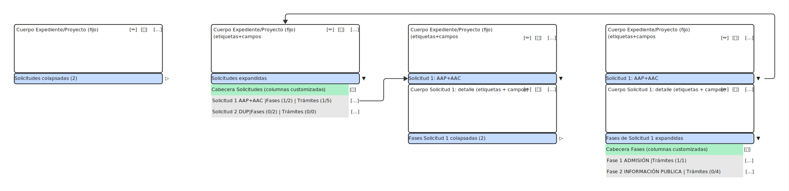

# VISTA V3 - TRAMITACIÓN CON ACORDEÓN JERÁRQUICO

**Estado:** 🟡 En desarrollo (Fase 1 completada)  
**Patrón UI:** Vista Tramitación con Acordeón  
**Epic:** #93 - Sistema de Navegación UI Modular  
**Última actualización:** 12 de febrero de 2026

---

## ⚠️ CAMBIO ARQUITECTÓNICO (12/02/2026)

**Decisión:** Eliminar arquitectura de **sidebar lateral** en favor de **acordeón completo en zona de contenido principal**.

### Ventajas del Cambio

1. **Mayor espacio horizontal**: 100% del ancho disponible para contenido vs 70% anterior
2. **Menos código JavaScript**: No sincronización sidebar ↔ detalle
3. **Bootstrap nativo**: Acordeones de Bootstrap 5 sin customización pesada
4. **UX familiar**: Patrón Gmail/Trello (expandir/colapsar in-place)
5. **Contexto visual**: Datos de expediente/proyecto siempre visibles arriba

---

## 📋 Índice

1. [Descripción General](#descripción-general)
2. [Mockup Visual](#mockup-visual)
3. [Modelo de Datos Expediente/Proyecto/Solicitud](#modelo-de-datos-expedienteproyectosolicitud)
4. [Características Implementadas](#características-implementadas)
5. [Arquitectura de Layout](#arquitectura-de-layout)
6. [Componentes Principales](#componentes-principales)
7. [Navegación Jerárquica](#navegación-jerárquica)
8. [Archivos del Proyecto](#archivos-del-proyecto)
9. [Plan de Implementación](#plan-de-implementación)
10. [Testing y Validación](#testing-y-validación)
11. [Referencias](#referencias)

---

## Descripción General

La Vista V3 (Tramitación) es un **patrón de interfaz con acordeón jerárquico** diseñado para la navegación dentro de un expediente específico. Permite al usuario moverse entre solicitudes, fases, trámites y tareas de forma fluida mediante acordeones expandibles anidados.

### Objetivo

Proporcionar una interfaz eficiente para la tramitación completa de expedientes de alta tensión, con navegación clara y acceso rápido a todos los elementos de la jerarquía: Expediente → Solicitudes → Fases → Trámites → Tareas.

### Características Clave

- **Panel superior fijo** (sticky) con datos Expediente + Proyecto
- **Acordeón principal** con solicitudes expandibles/colapsables
- **Acordeones anidados** (Solicitudes → Fases → Trámites → Tareas)
- **Columnas customizadas** en cabeceras de acordeón (ej: "Fases (1/2) | Trámites (1/5)")
- **Botones de acción** en cada nivel: `[✏️]` Editar, `[➕]` Añadir, `[...]` Ver detalle
- **Bootstrap 5 Accordion nativo** como base (menor complejidad JavaScript)
- **100% ancho disponible** para contenido (no hay sidebar lateral)

---

## Mockup Visual

### Diseño Completo



**Figura 1:** Estructura completa del acordeón jerárquico sin sidebar lateral.

### Descripción del Mockup

El mockup muestra dos estados de la Vista V3:

#### Estado 1: Solicitudes Colapsadas (izquierda)
```
┌──────────────────────────────────────────────┐
│ EXPEDIENTE + PROYECTO (fijo, sticky)         │
│  [✏️] [➕] [...]                              │
├──────────────────────────────────────────────┤
│ ▷ Solicitudes (2)                            │
│   (colapsadas, solo cabecera visible)        │
└──────────────────────────────────────────────┘
```

#### Estado 2: Solicitudes Expandidas (centro/derecha)
```
┌──────────────────────────────────────────────┐
│ EXPEDIENTE + PROYECTO (fijo, sticky)         │
├──────────────────────────────────────────────┤
│ ▼ Solicitudes Expandidas                     │
│                                              │
│   Cabecera Solicitudes (columnas custom)    │
│   ├─ Solicitud 1: AAP+AAC | Fases 1/2  [...] │
│   └─ Solicitud 2: DUP | Fases 0/2      [...] │
│                                              │
│   [Al expandir Solicitud 1 con ▼]           │
│                                              │
│   ┌─ Cuerpo Solicitud 1: detalle            │
│   │  (etiquetas + campos)                   │
│   │  [✏️] [➕] [...]                         │
│   │                                          │
│   │ ▼ Fases de Solicitud 1                  │
│   │                                          │
│   │   Cabecera Fases (columnas custom)      │
│   │   ├─ Fase 1: ADMISIÓN | Trámites 1/1 [...]│
│   │   └─ Fase 2: INFO PÚBLICA | Trámites 0/4 [...]│
│   └──────────────────────────────────────────│
└──────────────────────────────────────────────┘
```

---

## Modelo de Datos Expediente/Proyecto/Solicitud

### Relaciones Correctas

```
EXPEDIENTES ←──────────────→ PROYECTOS
  ├─ id                       ├─ id
  ├─ numero_at                ├─ expediente_id (FK)
  ├─ proyecto_id (FK)         └─ titulo
  └─ ...

SOLICITUDES
  ├─ id
  ├─ expediente_id (FK → EXPEDIENTES)
  └─ ... (NO tiene proyecto_id ❌)
```

### Puntos Clave

1. **Expediente y Proyecto son entidades hermanas** ligadas bidireccionalmente (1:1)
2. **Solicitudes solo conocen al Expediente**, acceden al proyecto vía `solicitud.expediente.proyecto`
3. **En Vista 3:**
   - Panel fijo superior muestra **Expediente + Proyecto** juntos (no en acordeón)
   - Proyecto NO aparece en acordeón jerárquico (no es parte de la tramitación)
   - Acordeón muestra: **Solicitudes → Fases → Trámites → Tareas**

### Navegación en Código

```python
# ✅ CORRECTO - A través del expediente
proyecto = solicitud.expediente.proyecto

# ❌ INCORRECTO - Esta relación NO existe
proyecto = solicitud.proyecto
```

---

## Características Implementadas

### ✅ Fase 1 - Estructura Base Layout + Mockup (COMPLETADA)

#### Layout y CSS Base
- ✅ Layout `base_tramitacion.html` con estructura simple (sin grid 2 columnas)
- ✅ CSS `v3-tramitacion.css` con:
  - Estilos panel contexto expediente/proyecto (sticky)
  - Estilos acordeón lista colapsada/expandida
  - Responsive básico

#### Template Mockup con Datos Hardcodeados
- ✅ Template `tramitacion_v3.html` con **mockup básico**:
  - Panel superior expediente/proyecto
  - Lista solicitudes básica

#### Ruta Flask
- ✅ Ruta `/tramitacion/<id>` para acceder a Vista V3
- ✅ Integración con sistema de autenticación

### 🔴 Fase 2 - Acordeón Principal con Bootstrap 5 (PENDIENTE)

**Cambio respecto a diseño original:** De "Sidebar Acordeón Dinámico" → "Acordeón Principal Bootstrap 5"

- [ ] Implementar acordeón Bootstrap 5 para solicitudes
- [ ] Cabeceras con columnas customizadas (Tipo | Fases | Trámites | Estado)
- [ ] Botones `[...]` en cada fila para expandir detalle
- [ ] Cuerpo expandible con datos completos de solicitud
- [ ] API Backend: `GET /api/expedientes/<id>/estructura_completa`

### 🔴 Fase 3 - Acordeones Anidados (Fases, Trámites, Tareas) (PENDIENTE)

**Cambio respecto a diseño original:** De "Panel Detalle con Tabs" → "Acordeones Anidados"

- [ ] Acordeón Fases dentro de cada Solicitud expandida
- [ ] Acordeón Trámites dentro de cada Fase expandida
- [ ] Acordeón Tareas dentro de cada Trámite expandido
- [ ] Indentación visual con borde izquierdo para jerarquía
- [ ] CSS customizado para acordeones anidados

### 🔴 Fase 4 - Panel Contexto y Botones de Acción (PENDIENTE)

- [ ] Panel fijo superior (sticky) con Expediente + Proyecto
- [ ] Botones `[✏️]` `[➕]` `[...]` en cada nivel
- [ ] Modales o páginas para editar/ver detalle
- [ ] Funcionalidad añadir (solicitud, fase, trámite, tarea)

### 🔴 Fase 5 - Carga de Datos y APIs (PENDIENTE)

- [ ] API `GET /api/expedientes/<id>/estructura_completa` con JSON completo
- [ ] JavaScript para renderizar acordeón desde datos JSON
- [ ] Carga lazy opcional (si performance es problema)
- [ ] Caché en localStorage para navegación rápida

### 🔴 Fase 6 - Integración y Testing (PENDIENTE)

- [ ] Conexión con Vista V2 (botón [Tramitar])
- [ ] Testing completo con expediente real (8 solicitudes × 6 fases)
- [ ] Documentación actualizada

---

## Arquitectura de Layout

### Estructura Jerárquica (Nuevo Diseño)

```
A: app-container (grid header/main/footer)
├── B.1: app-header (sticky top)
├── B.2: app-main (scroll simple, sin grid 2 columnas)
│   ├── C.panel-contexto-fijo (expediente + proyecto, sticky)
│   │   ├── expediente-info (datos expediente)
│   │   └── proyecto-info (datos proyecto)
│   ├── C.accordion-solicitudes (Bootstrap 5 accordion)
│   │   └── accordion-item (solicitud)
│   │       ├── accordion-header (cabecera con columnas)
│   │       └── accordion-body (cuerpo expandible)
│   │           ├── detalle-solicitud (datos completos)
│   │           └── accordion-fases (acordeón anidado)
│   │               └── accordion-item (fase)
│   │                   ├── accordion-header
│   │                   └── accordion-body
│   │                       ├── detalle-fase
│   │                       └── accordion-tramites (anidado)
│   │                           └── accordion-item (trámite)
│   │                               ├── accordion-header
│   │                               └── accordion-body
│   │                                   ├── detalle-tramite
│   │                                   └── accordion-tareas (anidado)
└── B.3: app-footer (sticky bottom)
```

### Sin Grid 2 Columnas

**Cambio importante:** Ya NO hay grid con sidebar + divisor + detalle.

```css
/* ANTES (diseño original con sidebar) */
.app-main {
    display: grid;
    grid-template-columns: 250px 4px 1fr;
}

/* AHORA (diseño con acordeón) */
.app-main {
    padding: 1rem;
    max-width: 1400px;
    margin: 0 auto;
}
```

---

## Componentes Principales

### 1. Panel Contexto Expediente/Proyecto (Fijo, Sticky)

#### Características

- **Posición**: Sticky top (debajo del header)
- **Contenido**: Datos expediente + datos proyecto juntos
- **Siempre visible**: Mantiene contexto mientras se navega por solicitudes/fases
- **Botones de acción**: `[✏️]` Editar, `[➕]` Añadir solicitud, `[...]` Ver detalle completo

#### Estructura HTML

```html
<div class="panel-contexto-fijo">
  <div class="expediente-info">
    <h2>🗂️ Expediente AT-2024-0042</h2>
    <p>Estado: En tramitación | Fecha: 15/01/2026</p>
    <button>[✏️]</button>
    <button>[➕]</button>
    <button>[...]</button>
  </div>
  
  <div class="proyecto-info">
    <h3>🏗️ Proyecto: Línea 132 kV Sevilla-Córdoba</h3>
    <p>Promotor: REE | Potencia: 132 kV</p>
    <button>[✏️]</button>
    <button>[...]</button>
  </div>
</div>
```

#### CSS Necesario

```css
.panel-contexto-fijo {
  position: sticky;
  top: 60px; /* Altura del header */
  z-index: 100;
  background: #f8f9fa;
  border-bottom: 2px solid #dee2e6;
  padding: 1rem;
  margin-bottom: 1.5rem;
}
```

---

### 2. Acordeón Principal (Solicitudes)

#### Características

- **Bootstrap 5 Accordion** como base
- **Cabeceras con columnas customizadas**: Tipo | Fases | Trámites | Estado
- **Botón expandir** `[...]` o icono `▷/▼` para mostrar/ocultar cuerpo
- **Cuerpo expandible** con datos completos de solicitud + acordeón fases anidado

#### Estructura HTML

```html
<div class="accordion" id="accordionSolicitudes">
  
  <div class="accordion-item">
    <h2 class="accordion-header">
      <button class="accordion-button collapsed" 
              data-bs-toggle="collapse" 
              data-bs-target="#collapseSol1">
        <span class="col-tipo">Solicitud 1: AAP+AAC</span>
        <span class="col-fases">Fases (1/2)</span>
        <span class="col-tramites">Trámites (1/5)</span>
        <span class="badge bg-success">Activa</span>
      </button>
    </h2>
    
    <div id="collapseSol1" class="accordion-collapse collapse">
      <div class="accordion-body">
        
        <!-- Detalle Solicitud 1 -->
        <div class="detalle-solicitud">
          <p>Fecha presentación: 15/01/2026</p>
          <p>Promotor: Endesa</p>
          <button>[✏️]</button>
          <button>[...]</button>
        </div>
        
        <!-- Acordeón anidado: Fases -->
        <div class="accordion accordion-anidado" id="accordionFases-Sol1">
          <!-- Items de fases aquí -->
        </div>
        
      </div>
    </div>
  </div>
  
  <div class="accordion-item">
    <!-- Solicitud 2 -->
  </div>
  
</div>
```

#### CSS Customización

```css
/* Botones acordeón con layout flexbox para columnas */
.accordion-button {
  display: flex;
  justify-content: space-between;
  align-items: center;
}

.accordion-button > span {
  flex: 0 0 auto;
  margin-right: 1rem;
}

/* Columnas customizadas en cabecera acordeón */
.col-tipo { width: 200px; }
.col-fases { width: 100px; }
.col-tramites { width: 100px; }
```

---

### 3. Acordeones Anidados (Fases, Trámites, Tareas)

#### Características

- **Mismo patrón** que acordeón principal, pero anidado
- **Indentación visual** con margen izquierdo + borde
- **3 niveles de anidación**: Fases → Trámites → Tareas

#### CSS para Anidación

```css
/* Indentación visual para acordeones anidados */
.accordion .accordion {
  margin-left: 2rem;
  border-left: 3px solid #0d6efd;
  padding-left: 1rem;
}

/* Segundo nivel anidado (trámites) */
.accordion .accordion .accordion {
  border-left-color: #198754;
}

/* Tercer nivel anidado (tareas) */
.accordion .accordion .accordion .accordion {
  border-left-color: #ffc107;
}
```

---

### 4. Botones de Acción

#### Tipos de Botones

- **`[✏️]`** - Editar elemento (modal o nueva página)
- **`[➕]`** - Añadir hijo (modal con formulario)
- **`[...]`** - Ver detalle completo (expandir o nueva página)

#### Ubicación

- **Panel contexto**: Editar expediente/proyecto, añadir solicitud
- **Cabecera acordeón**: Expandir/colapsar (Bootstrap maneja automáticamente)
- **Cuerpo acordeón**: Editar elemento, añadir hijo

---

## Navegación Jerárquica

### Flujo de Navegación

```
Vista V2 (Listado expedientes)
    ↓ [Clic en botón "Tramitar"]
Vista V3 (Expediente AT-2024-0042)
    ├─ Panel contexto: Expediente + Proyecto visible
    └─ Acordeón: Solicitudes colapsadas
        ↓ [Clic en ▷ Solicitud 1]
Vista V3 (Solicitud 1 expandida)
    ├─ Datos solicitud visibles
    └─ Acordeón fases colapsado
        ↓ [Clic en ▷ Fase 1]
Vista V3 (Fase 1 expandida)
    ├─ Datos fase visibles
    └─ Acordeón trámites colapsado
        ↓ [Clic en ▷ Trámite 1]
Vista V3 (Trámite 1 expandido)
    ├─ Datos trámite visibles
    └─ Acordeón tareas visible
```

### Sin Sincronización Compleja

**Ventaja del diseño acordeón:** Bootstrap 5 maneja toda la lógica de expandir/colapsar. NO necesitas:

- ❌ Sincronizar sidebar con panel detalle
- ❌ Gestionar estado seleccionado manualmente
- ❌ Breadcrumb complejo (opcional: puede ir en panel contexto)
- ❌ Divisor redimensionable

---

## Archivos del Proyecto

### CSS Creados/Actualizados

| Archivo | Descripción | Estado |
|---------|-------------|--------|
| `app/static/css/v3-tramitacion.css` | Estilos Vista V3 (actualizar para acordeón) | 🔄 Fase 2 |

### JavaScript Creados/Actualizados

| Archivo | Descripción | Estado |
|---------|-------------|--------|
| `app/static/js/v3-accordion-main.js` | Lógica acordeón principal (nuevo) | 🔴 Fase 2 |
| ~~`app/static/js/v3-sidebar-accordion.js`~~ | ~~Lógica sidebar~~ (deprecado) | ❌ Eliminado |
| ~~`app/static/js/v3-tabs.js`~~ | ~~Sistema tabs~~ (deprecado) | ❌ Eliminado |
| ~~`app/static/js/v3-breadcrumb.js`~~ | ~~Breadcrumb dinámico~~ (opcional) | ⚠️ Opcional |

### Templates Creados/Actualizados

| Archivo | Descripción | Estado |
|---------|-------------|--------|
| `app/templates/layout/base_tramitacion.html` | Layout base V3 (actualizar sin grid) | 🔄 Fase 2 |
| `app/templates/expedientes/tramitacion_v3.html` | Vista tramitación (actualizar acordeón) | 🔄 Fase 2 |

### Rutas Flask

| Ruta | Descripción | Estado |
|------|-------------|--------|
| `/tramitacion/<int:id>` | Acceso a Vista V3 | ✅ Fase 1 |

---

## Plan de Implementación

### Fase 1: Estructura Base Layout + Mockup ✅ COMPLETADA

**Duración:** 2-3 días  
**Estado:** ✅ Completada el 08/02/2026

- [x] Crear `base_tramitacion.html` (layout V3 básico)
- [x] Crear `v3-tramitacion.css` con estilos básicos
- [x] Template `tramitacion_v3.html` con mockup inicial
- [x] Ruta Flask `/tramitacion/<id>`

### Fase 2: Acordeón Principal con Bootstrap 5 🔴 PENDIENTE

**Duración estimada:** 3-4 días

#### 2.1 Panel Contexto Fijo
- [ ] Implementar panel sticky superior
- [ ] Mostrar datos expediente + proyecto juntos
- [ ] Botones `[✏️]` `[➕]` `[...]` funcionales

#### 2.2 Acordeón Solicitudes
- [ ] Implementar acordeón Bootstrap 5 para solicitudes
- [ ] Cabeceras con columnas customizadas
- [ ] CSS para layout flexbox en cabeceras
- [ ] Cuerpo con datos completos de solicitud

#### 2.3 API Backend
- [ ] Endpoint `GET /api/expedientes/<id>/estructura_completa`:
  - Expediente + Proyecto anidado
  - Solicitudes con fases/trámites/tareas incluidos
  - Una sola petición HTTP (600 KB aprox)

### Fase 3: Acordeones Anidados (Fases, Trámites, Tareas) 🔴 PENDIENTE

**Duración estimada:** 3-4 días

#### 3.1 Acordeón Fases
- [ ] Implementar acordeón fases dentro de cada solicitud
- [ ] CSS para indentación visual (margen + borde)
- [ ] Cabeceras con columnas: Fase | Trámites | Estado

#### 3.2 Acordeón Trámites
- [ ] Implementar acordeón trámites dentro de cada fase
- [ ] CSS para segundo nivel anidado
- [ ] Cabeceras con columnas: Trámite | Tareas | Estado

#### 3.3 Acordeón Tareas
- [ ] Implementar acordeón tareas dentro de cada trámite
- [ ] CSS para tercer nivel anidado
- [ ] Listado simple de tareas

### Fase 4: Botones de Acción y Modales 🔴 PENDIENTE

**Duración estimada:** 2-3 días

#### 4.1 Botones Editar `[✏️]`
- [ ] Modal o página para editar expediente
- [ ] Modal o página para editar solicitud/fase/trámite/tarea
- [ ] Formularios con validación

#### 4.2 Botones Añadir `[➕]`
- [ ] Modal para añadir solicitud (desde panel contexto)
- [ ] Modal para añadir fase (desde solicitud expandida)
- [ ] Modal para añadir trámite (desde fase expandida)
- [ ] Modal para añadir tarea (desde trámite expandido)

#### 4.3 Botones Ver Detalle `[...]`
- [ ] Expandir acordeón (Bootstrap maneja automáticamente)
- [ ] O modal con vista completa del elemento

### Fase 5: Carga de Datos y Renderizado 🔴 PENDIENTE

**Duración estimada:** 2 días

#### 5.1 JavaScript Renderizado
- [ ] Crear `v3-accordion-main.js`:
  - Cargar datos desde API `estructura_completa`
  - Renderizar acordeón completo desde JSON
  - Bootstrap maneja eventos expand/collapse

#### 5.2 Optimización Performance
- [ ] Opción A: Carga completa (600 KB) en una petición
- [ ] Opción B: Carga lazy por nivel (si performance problema)
- [ ] Caché en localStorage para navegación rápida

### Fase 6: Integración y Testing 🔴 PENDIENTE

**Duración estimada:** 2 días

#### 6.1 Integración con Vista V2
- [ ] Botón [Tramitar] en V2 → carga V3 con expediente seleccionado
- [ ] Breadcrumb opcional "← Volver a listado"

#### 6.2 Testing
- [ ] Testing visual: panel contexto, acordeones anidados, responsive
- [ ] Testing funcional: expandir/colapsar, botones acción
- [ ] Testing con expediente real (8 solicitudes × 6 fases × 5 trámites)
- [ ] Testing performance: 1440 registros carga en <500ms

#### 6.3 Documentación
- [ ] Actualizar este documento con implementación completa
- [ ] Ejemplos de uso API
- [ ] Screenshots finales

---

## Testing y Validación

### Testing Visual (Fase 1) ✅ COMPLETADO

- [x] Vista V3 carga correctamente en `/tramitacion/1`
- [x] Layout básico funcional

### Testing Funcional (Fases 2-6) 🔴 PENDIENTE

#### Fase 2
- [ ] Panel contexto sticky funciona al hacer scroll
- [ ] Botones `[✏️]` `[➕]` `[...]` en panel contexto funcionan
- [ ] Acordeón solicitudes expande/colapsa correctamente
- [ ] Cabeceras con columnas alineadas correctamente

#### Fase 3
- [ ] Acordeones anidados (fases, trámites, tareas) funcionan
- [ ] Indentación visual correcta con bordes de colores
- [ ] No hay conflictos entre niveles anidados

#### Fase 4
- [ ] Modales editar/añadir se abren correctamente
- [ ] Formularios validan datos antes de enviar
- [ ] Cambios se reflejan en acordeón tras guardar

#### Fase 5
- [ ] API `estructura_completa` devuelve JSON correcto
- [ ] JavaScript renderiza acordeón desde JSON
- [ ] Carga de 1440 registros en <500ms
- [ ] Navegación fluida sin lag

#### Fase 6
- [ ] Integración V2 → V3 funciona correctamente
- [ ] Volver a listado desde V3 funciona
- [ ] Testing completo con expediente real

### Testing Responsive 🔴 PENDIENTE

- [ ] Desktop (>1200px): Acordeón con columnas visibles
- [ ] Tablet (768-1199px): Columnas apiladas si es necesario
- [ ] Mobile (<768px): Acordeón compacto, columnas ocultas

---

## Referencias

### Epic y Issues

- [Epic #93](https://github.com/genete/bddat/issues/93) - Sistema de Navegación UI Modular
- [Issue #101](https://github.com/genete/bddat/issues/101) - Vista V3 Tramitación (Fase 1+2)
- [Comentario #101](https://github.com/genete/bddat/issues/101#issuecomment-3890255354) - Cambio arquitectónico acordeón

### Documentación Relacionada

- [PATRONES_UI.md](../arquitectura/PATRONES_UI.md) - Patrones UI completos
- [ISSUE_94_ESTRUCTURA.md](ISSUE_94_ESTRUCTURA.md) - Sistema de vistas V0/V1/V2/V3
- [Bootstrap 5 Accordion](https://getbootstrap.com/docs/5.3/components/accordion/) - Documentación oficial
- Mockup visual: [vista3.svg](./mockups/vista3.svg)
- Modelo de datos: `schema.sql` + `docs/fuentesIA/referencias/tablas/O_003_SOLICITUDES.md`

### Pull Requests

- PR pendiente - Vista V3 (Tramitación Fase 1+2) 🔴 Pendiente

---

## Notas de Diseño

### Diferencia con Diseño Original

| Aspecto | Diseño Original (Sidebar) | Diseño Nuevo (Acordeón) |
|---------|---------------------------|-------------------------|
| **Layout** | Grid 2 columnas (sidebar + detalle) | Layout simple (100% ancho) |
| **Navegación** | Sidebar lateral 250px | Acordeón expandible in-place |
| **Espacio** | 70% para contenido | 100% para contenido |
| **Sincronización** | Sidebar ↔ Detalle | No necesaria (Bootstrap maneja) |
| **JavaScript** | Complejo (3 componentes) | Simple (renderizado + Bootstrap) |
| **Divisor** | Redimensionable | No existe |
| **Breadcrumb** | Dinámico obligatorio | Opcional (panel contexto) |
| **Tabs** | [Datos] [Docs] [Historial] | Acordeones anidados |

### Decisiones de Diseño

**Acordeón vs Sidebar:**
- ✅ **Elegido**: Acordeón en contenido principal
- ❌ **Descartado**: Sidebar lateral con sincronización
- **Razón**: Más espacio, menos complejidad, UX familiar (Gmail/Trello)

**Panel contexto fijo:**
- ✅ **Elegido**: Expediente + Proyecto juntos en panel sticky
- **Razón**: Mantiene contexto del expediente mientras se navega por solicitudes/fases. No son parte de la jerarquía de tramitación (no van en acordeón).

**Bootstrap 5 Accordion nativo:**
- ✅ **Elegido**: Usar componente Bootstrap como base
- **Razón**: Maneja eventos expand/collapse automáticamente. Menos JavaScript custom. Accesibilidad incluida.

**Carga completa vs Lazy:**
- ✅ **Elegido**: Opción A por defecto (carga completa 600 KB)
- **Razón**: Red local corporativa (100-300ms). Navegación instantánea tras carga inicial. Lazy solo si hay problemas de performance.

### Modelo Expediente/Proyecto

**Corrección importante:** Expediente y Proyecto NO son padre-hijo en la jerarquía de tramitación. Son entidades hermanas (1:1) que se muestran juntas en el panel contexto.

**Por qué NO van en acordeón:**
- Proyecto es información técnica asociada al expediente, no una fase de tramitación
- Solicitudes apuntan al expediente, no al proyecto
- Mostrarlos juntos en panel fijo evita confusión jerárquica

---

## Historial de Cambios

**12/02/2026 - Cambio arquitectónico:**
- ⚠️ **CAMBIO MAYOR**: De sidebar lateral → acordeón en contenido principal
- Actualizado mockup visual: `vista3.svg` incluido
- Corregido modelo de datos expediente/proyecto/solicitud
- Rediseñadas Fases 2-6 acorde al nuevo diseño
- Eliminadas referencias a sidebar, divisor, tabs, breadcrumb complejo
- Actualizado plan de implementación completo

**08/02/2026 - Fase 1 completada (diseño original):**
- Creado layout `base_tramitacion.html` con grid 2 columnas
- Creado CSS `v3-tramitacion.css` básico
- Creado template mockup `tramitacion_v3.html`
- Creada ruta Flask `/tramitacion/<id>`
- Creado documento `VISTA_V3_TRAMITACION.md`

---

**✏️ Changelog completo en commits individuales**
